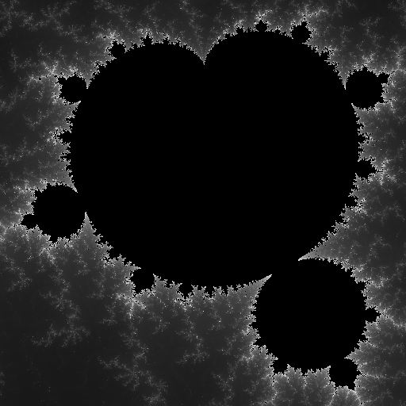

Множество Мандельброта
===============

##### ENV параметры

* `WORKERS` - количество одновременно обрабатываемых процессов, Если параметр пустой то берем значение по умолчанию как количество процессоров
* `CACHE_DIR` - папка кэша, по умолчанию `./cache/`
* `CACHE_LIMIT` - размер ограничения для папки кэша, значение в байтах, для других вариантов надо добавить `K`,` M`, `G`,` T` в конце значения, по умолчанию `16G`

##### Файл конфигурации
`config/sizes.json` - Список размеров в виде `json`

## Запрос
Запрос в урл `/mandelbrot/` с `GET` параметрами
* `x`, `y` - координаты с плавающей точкой
* `zoom` - целочисленный фактор приближения
* `res` - строка задающая разрешение выходного изображения

#### Результат
В результат возвращается готовая изображение

#### Пример
###### Запрос
`http://localhost:3020/mandelbrot/?x=-26.8672155&y=175.046014&zoom=20000000&rec=medium`  
Тут множество Мандельброта увеличен 20 миллионов раз
###### Результат
